# 2-1 二极管的I-V特性

1. 打开linux系统，右键桌面，点击[Open Terminal](),输入 `icfb &`(`icfb`打开candence的CIW界面,`&`将这个任务放到后台去执行)
   

2.

## 1.1 实验电路
根据电路图绘制电路，所用的元件分别是analogLib库中的vdc、res、diode和gnd

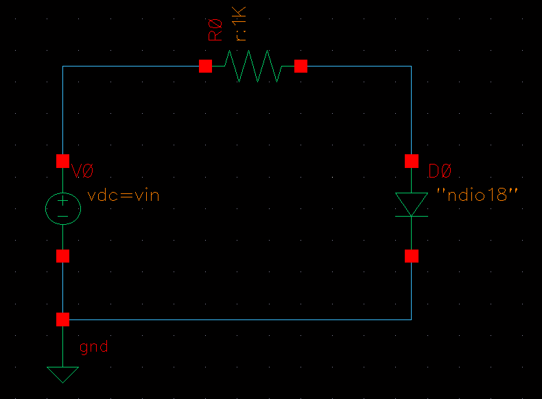

## 1.2 设置元器件参数

二极管的参数设置如图所示，在Model name栏填入ndio18，说明用的是1.8V的电源电压，并且是n+/pwell二极管，在Multiplier处填入1 (这代表此电路中用的二极管并联个数为1)，其它参数都采用默认设置。

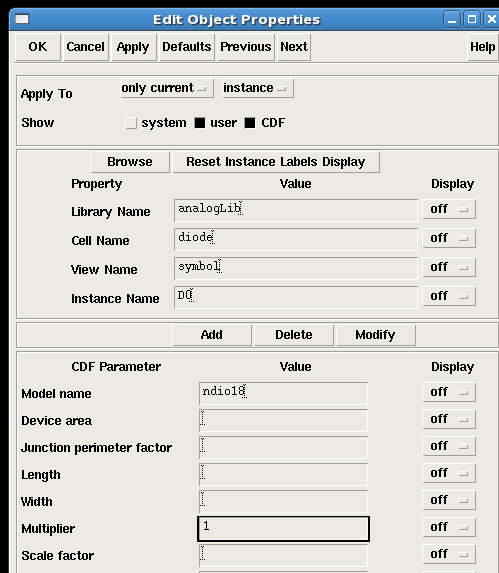

电压源的参数设置图所示，在DC voltage处填入`vin` (填入变量是为了要做直流扫描),不要填`vinV`,candence会自动加单位，默认为`V`,例如：600mV填入`600m`即可；如果自己加单位，用`vin V`，之间加上空格。

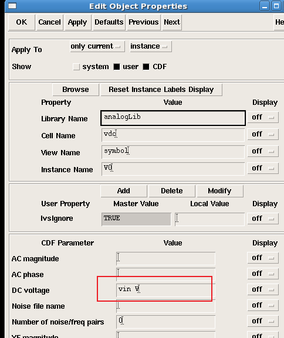

电阻的参数设置如图所示，在Resistance后面的框中输入电阻值(默认为1k，此处采用默认值)。

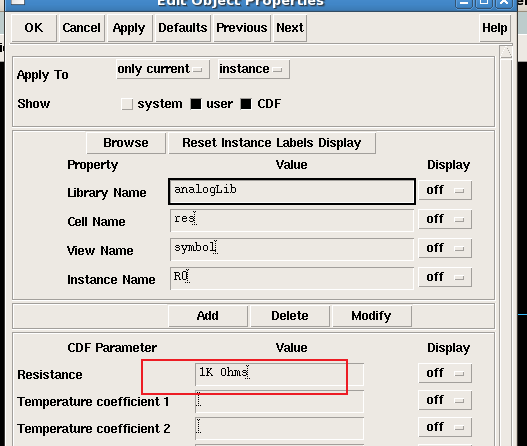

**电路图每做一次修改必须check&save！！！！！！！！**

所以，画完电路图点击左上角的检查和保存。

## 1.3 设置仿真参数

+ 在原理图编辑框（Virtuoso）中，选[Tools→Analog Environment](),打开ADE对话框。
+ 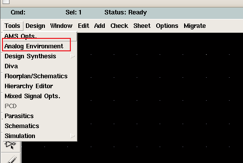

然后设置库路径。在ADE窗口中，选[Setup→Model Libraries](),在section项填入工艺角tt(典型工艺角),然后让光标停留在Model Library File框中，点击右下角的Browse,然后选择以下文件作为仿真模型库文件：/cad/smic018_tech/Process_technology/Mixed-Signal/SPICE_Model/ms018_v1p6_spe.lib然后点Add，得到如图1.5所示对话框：（最后点ok设置完毕）

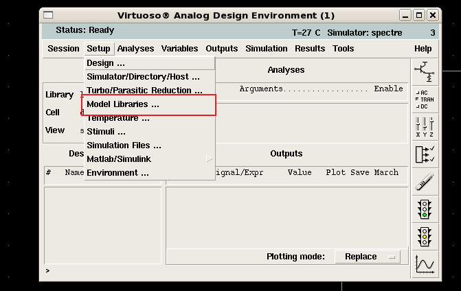

一般来说除非你用教程给的平台，否则基本上找不到仿真模型库，所以折腾了半天，没摸清原理，但是知道怎么找了，你找到类似我下面的文件夹，`SMIC`、`TMIC`等文件夹，路径自己找，基本上就在home里面，打开`SIMC`文件夹，打开`SMIC_018_MMRF`（打开另外一个也行）

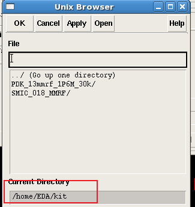

继续打开，路径应该是`/SMIC_018_MMRF/models/spectre`,`spectre`代表用`spectre模型`仿真(为啥我也不懂)

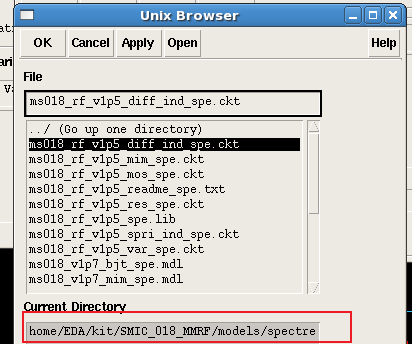

点击`ms018_v1p6_spe.lib`，然后如下图所示：点`ADD`，再点个`OK`

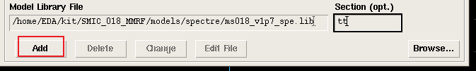

+ 开始编辑变量。在ADE窗口中点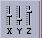按钮，就会弹出EDV窗口，然后在此窗口中点`Copy From`，会自动从原理图中提出相应的变量，我们前边的vin会被自动提出。将其初始值设置为0，初值可以任意，但一定要有，否则仿真会出错，如图所示。

  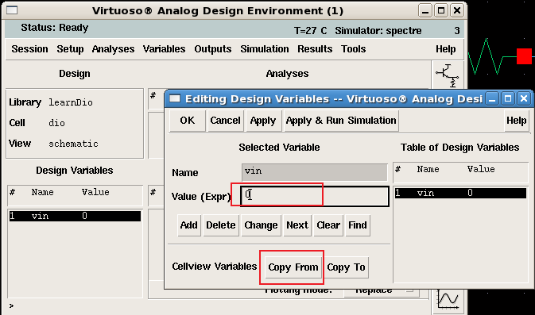

+ 选择分析类型。在ADE窗口中选`Analyses→Choose`,就会弹出分析类型对话框(即CA窗口)，然后选中`dc`（dc代表直流分析），`Save DC Operating Points`(为了方便观察管子的工作点而选)，在`Sweep Variable` 栏中选择`Design Variables`,然后于`Variable Name`栏输入要扫描的变量`vin`，具体设置如图所示：（表示对vin做直流扫描，从0到1.8V）最后点击ok设置完毕。
  + 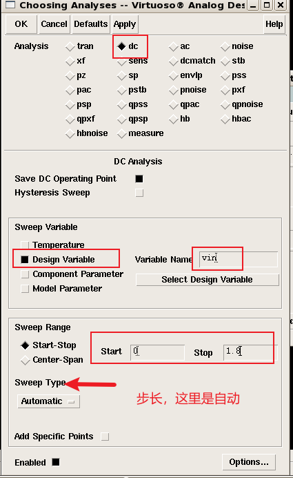

+ 输出设置。在ADE窗口中，选`Outputs→To Be Plotted→Slected On Schematic`。然后在电路图中选择想要观察电流的结点，本实验选二极管的阳极(注意：观察电流点击元件的pin脚，会出现一个彩色圆圈；观察电压点击相应的连线，连线会改变颜色)，选择完成后按键盘上的ESC键退出选择输出状态。在Analog design environment窗口中的Outputs输出部分就可以看到我们所选择的点。然后选`Outputs→To Be Plotted→Add To`保存输出。点击`Seession→Save State`保存当前仿真设置。完整的设置好的ADE对话框如图所示：

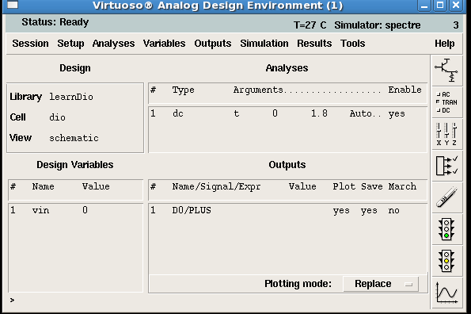

    ## 1.4 电路仿真

参数设置完毕之后，就可以开始电路仿真了。方法是在ADE窗口中，选`Simulation→Netlist and Run`就开始仿真了，如果整个过程都没错，那么系统会自动输出二级管的I-V曲线，如图所示。**记得`check&save`**!可以看到该二极管的阈值电压大约是0.6v左右。

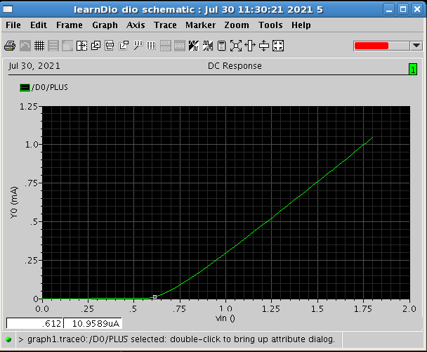

